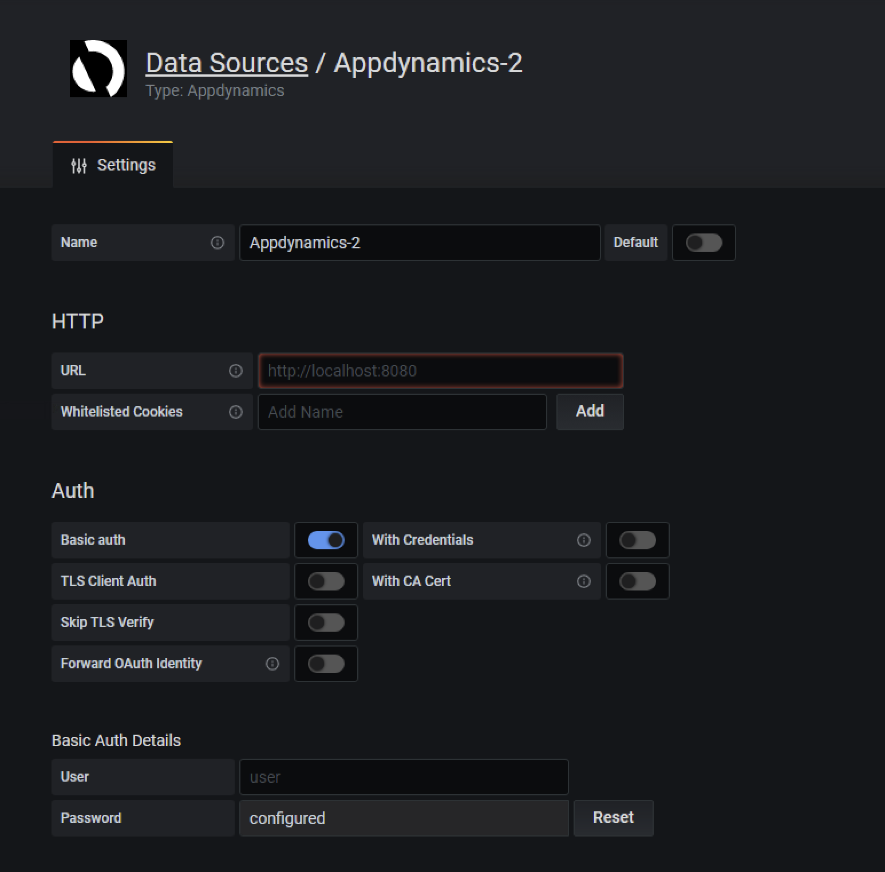
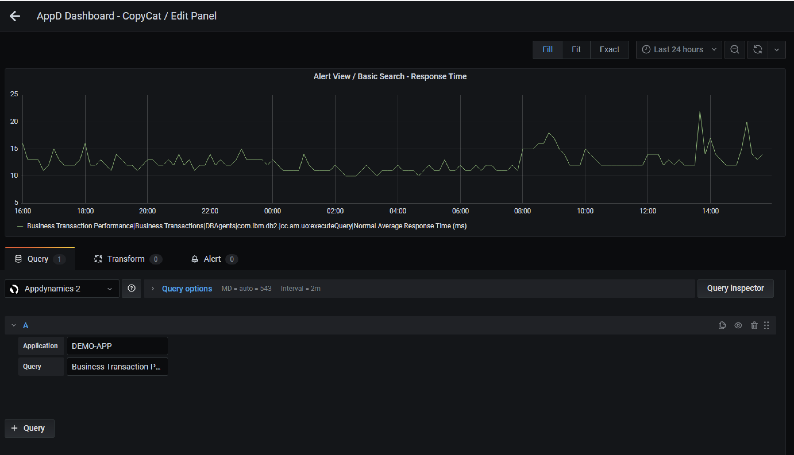

# AppDynamics Grafana Data Source Plugin

[](https://github.com/morganstanley/Plug-in-AppDynamics-Data-Source/actions/workflows/main.yml)

This is an AppDynamics Grafana Data Source Plugin.




## Getting started

1. Install dependencies

   ```bash
   npm install
   ```

2. Build plugin in development mode or run in watch mode

   ```bash
   npm run dev
   ```

   or

   ```bash
   npm run watch
   ```

3. Unit Testing

   ```bash
   npm run test
   ```

4. Build plugin in production mode

   ```bash
   npm run build
   ```

## Contribution Guide

### Become a contributor

You can contribute to us in several ways. Here are some examples:

- Contribute to the codebase.
- Report and triage bugs.
- Develop community plugins and dashboards.
- Write technical documentation and blog posts, for users and contributors.
- Organize meetups and user groups in your local area.
- Help others by answering questions about this plugin.

For more ways to contribute, check out the [Open Source Guides](https://opensource.guide/how-to-contribute/).

### Contributing
If you are interested in contributing to Fluent bit with bug fixes, new features or coding in general, please refer to the code [CONTRIBUTING](./CONTRIBUTING.md) guidelines. 
